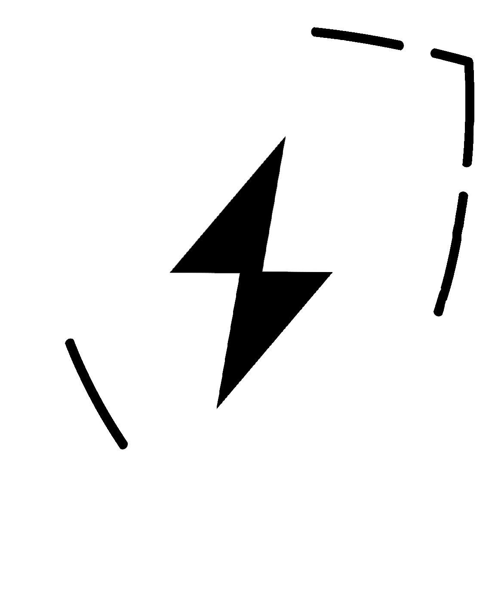
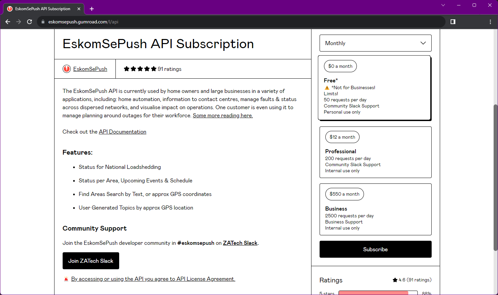
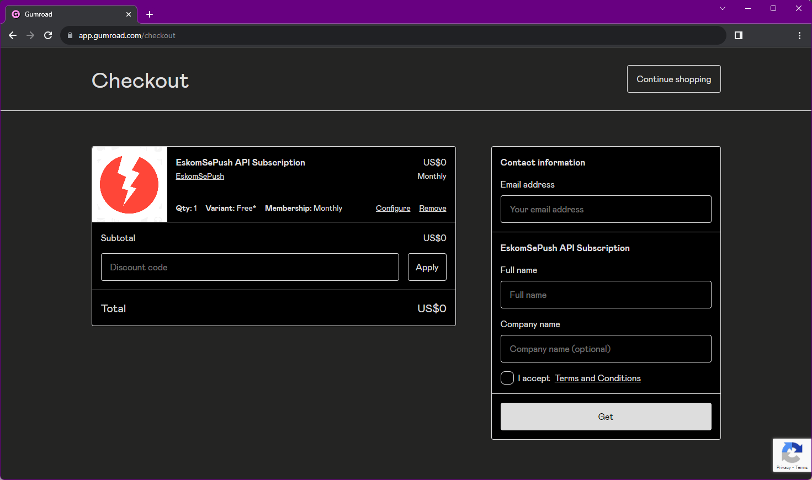
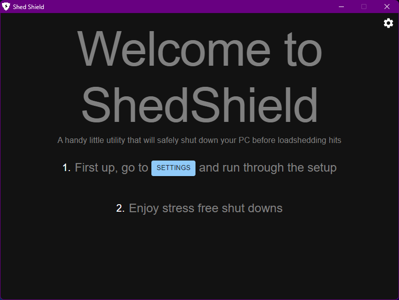
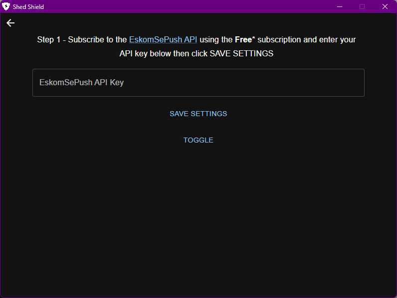
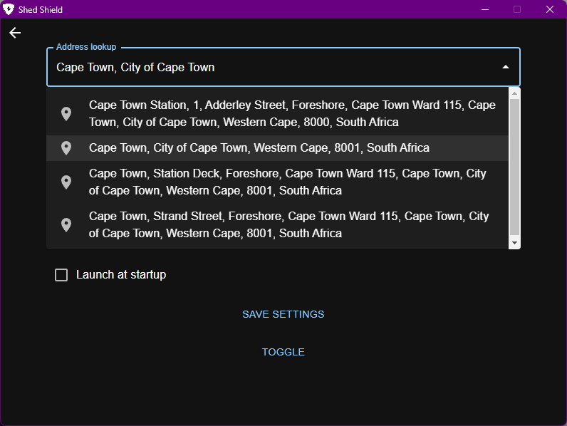
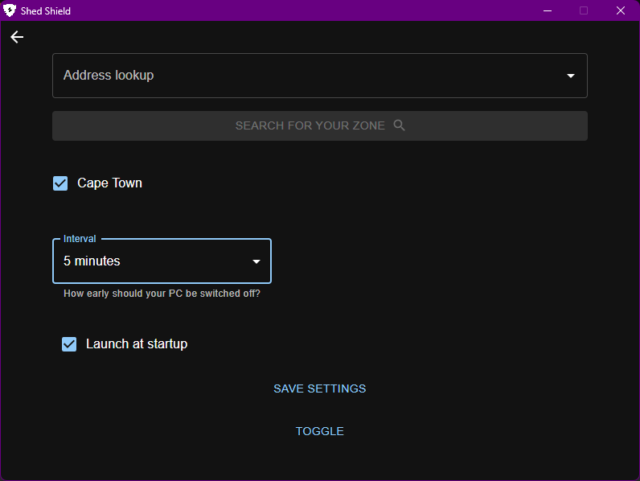
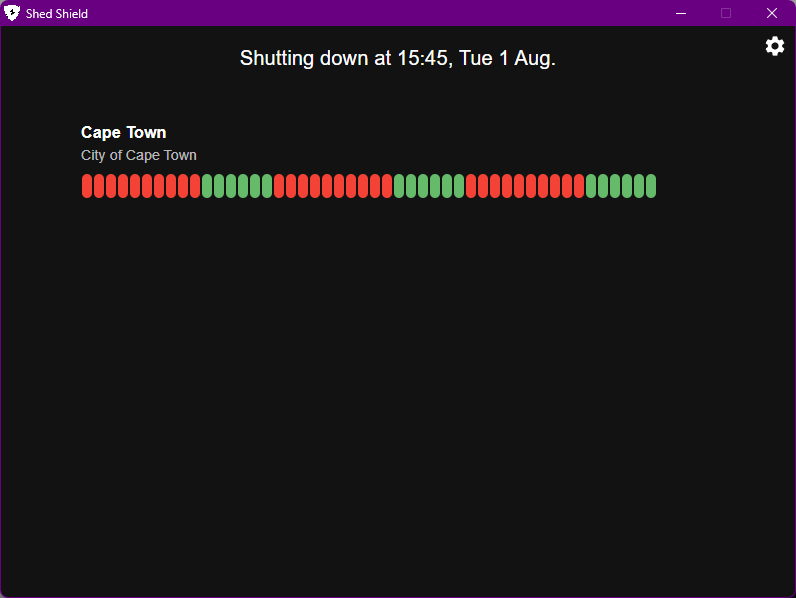
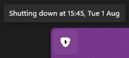

<h1 align='center'>
   
  
   
  Shed Shield
   
</h1>

<h4 align='center'>A handy little utility to shutdown your PC before loadingshedding hits. Built with <a href="https://www.electronjs.org/" target="_blank">Electron</a>.</h4>

 

---

**[SHED SHIELD](https://github.com/ZJouba/ShedShield#%EF%B8%8Fshed-shield) • 
[KEY FEATURES](https://github.com/ZJouba/ShedShield#-key-features) • 
[FIRST TIME SETUP](https://github.com/ZJouba/ShedShield#%EF%B8%8F-first-time-setup) • 
[DOWNLOAD](https://github.com/ZJouba/ShedShield#-download) • 
[CONTRIBUTING](https://github.com/ZJouba/ShedShield#-contributing) • 
[SUPPORT](https://github.com/ZJouba/ShedShield#support) • 
[LICENSE](https://github.com/ZJouba/ShedShield#-license)**

# 🛡️Shed Shield
Shed Shield uses the [EskomSePush](https://documenter.getpostman.com/view/1296288/UzQuNk3E#intro) API along with [Nominatum](https://nominatim.openstreetmap.org/ui/about.html) to look up your zone and adds a cron job to shutdown your PC before loadshedding cuts the power.

# 🔧 Key Features
* Shed Shield uses geolocation to find your closest zone
* Shed Shield can monitor multiple zones
* Shed Shield uses the most immediate loadshedding timeslot to schedule a shutdown
* Shed Shield can be configured to shutdown at specified intervals before loadshedding

# ⌨️ First time setup
### 1. EskomSePush API  
a. Before running Shed Shield, navigate to [EskomSePush API Subscription](https://eskomsepush.gumroad.com/l/api) and subscribe to the free tier  
  
b. Complete your details  
  
c. Use the provided API key when setting up Shed Shield

### 2. Shed Shield
When running Shed Shield for the first time, you first have to setup your API Key and then your zones.
a. Run Shed Shield  
  
b. Follow the instructions and go to the Settings tab  
  
c. Enter the API Key from [Step 1](#1-eskomsepush-api) into the input field  
d. Click the Save Settings button   
e. Search for your street address or nearest location using the Address lookup  
  
f. Click SEARCH FOR YOUR ZONE to search for your closest Zone  
<b>NB! Don't search for too many zones, this request uses 5 units of your API quota with EskomSePush!</b>  
g. Select the zones you want to monitor, the interval and be sure to check Launch at startup to have worry free shutdowns  
  
h. And that's all there is too it  
 

You can also see at what time the app will shutdown in the system tray  
   

<h3>Be sure to keep the app running in order to schedule the shutdowns. It will minimize to the system tray</h2>
 

# 💾 Download
You can [download](https://github.com/ZJouba/ShedShield/releases) the Shed Shield installer for Windows. (macOS & Linux are WIP)

# 🦾 Contributing
Shed Shield is an open-source project. We appreciate the community's involvement and feedback. Please refer to our [contribution](https://github.com/ZJouba/ShedShield/blob/master/CONTRIBUTING.md) guide for more information.

# 🙏Support

# 📜 License
Shed Shield is free and open-source software licensed under the [GNU General Public License v3.0.](https://github.com/ZJouba/ShedShield/blob/master/LICENSE)
